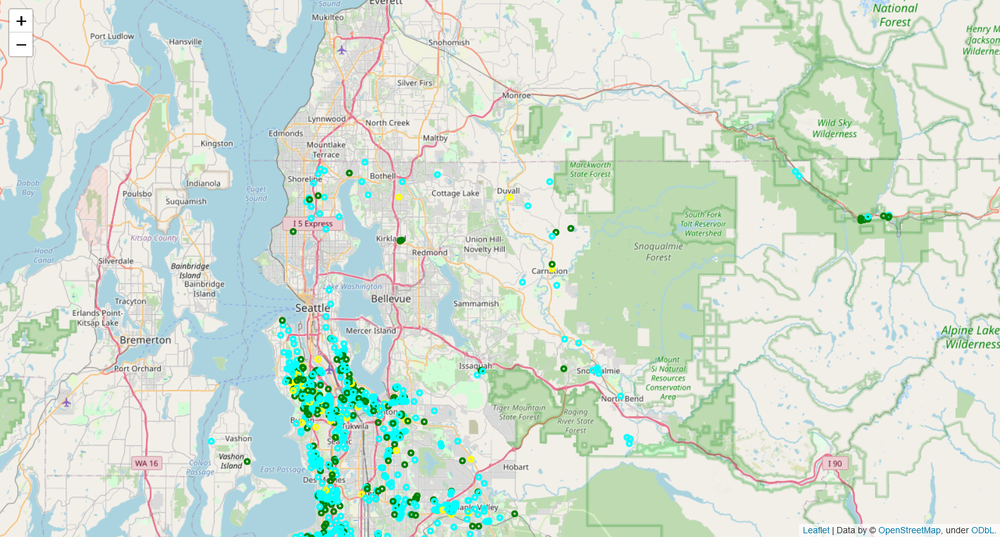

# IBM_House_Sales_in_King_County_USA

$\textcolor{#246EAA}{\textsf{Final Assignment for "IBM Course - Data Analysis with Python", May 2nd, 2022.}}$ 
$\textcolor{#246EAA}{\textsf{This project is part of IBM Data Science certificate. Reviewed and improved in August 2022.}}$

 
 
The project consists of finding the best model for predicting home prices in a county: King County, USA in Washington state, based on a dataset of homes sold between May 2014 and May 2015, including prices and a set of features.
 
 
 
#### <ul>[Jupyter Notebook: Version with Folium Interactive map](https://github.com/DrStef/House_Sales_in_King_County_USA_IBM/blob/main/Project_House_Sales_in_King_County_USA_v003.ipynb)</ul>

<ul> Folium maps will not display on Github. Import the Notebook and execute all cells locally.</ul>

  
  

#### <ul>[Jupyter Notebook: no interactive map](https://github.com/DrStef/House_Sales_in_King_County_USA_IBM/blob/main/Project_House_Sales_in_King_County_USA_v003_LTX.ipynb)</ul>

<ul>Version for LateX report and PDF document.</ul>
